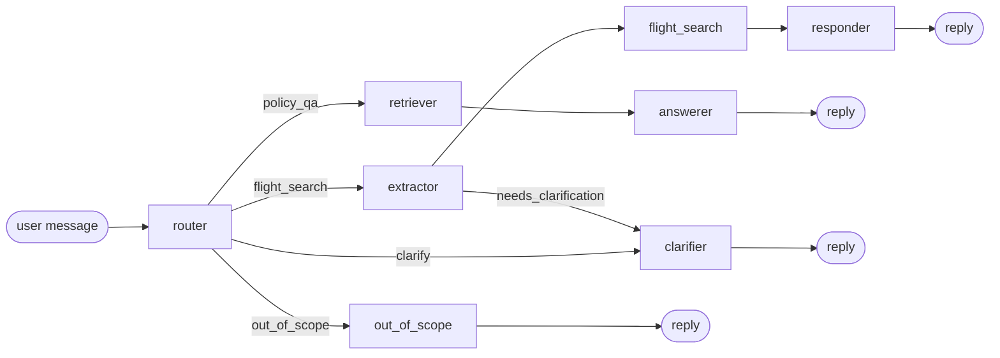

# Kavak Travel Assistant

> A conversational travel-planning agent — flight search, visa & refund Q&A, multi-turn refinement — built around three commitments: **prompts are versioned artifacts**, **hallucination is structurally impossible**, and **the agent's reasoning is observable**.

```
199 tests passing · live UAT 195/200 (97.5%) · 0 hallucinated citations · ~$0.001/turn
```

Submission for the **Kavak AI Prompt Engineer** technical case study.

---

## Table of contents

1. [Why this is interesting](#1-why-this-is-interesting)
2. [System overview](#2-system-overview)
3. [Setup instructions](#3-setup-instructions)
4. [Agent logic](#4-agent-logic)
5. [Prompt strategies](#5-prompt-strategies)
6. [Sample outputs](#6-sample-outputs)
7. [Evaluation](#7-evaluation)
8. [How this bot fails (and recovers)](#8-how-this-bot-fails-and-recovers)
9. [Repo layout](#9-repo-layout)
10. [Lessons learned & what's next](#10-lessons-learned--whats-next)

---

## 1. Why this is interesting

Five things that separate this submission from "did the assignment well":

1. **Prompts as versioned `.md` artifacts** with a [CHANGELOG](app/prompts/CHANGELOG.md) tying each prompt id to a content-hash and an eval baseline. Most candidates inline prompts as f-strings; here they are first-class engineering artefacts.
2. **Citation-by-construction RAG.** The schema requires citations, the post-processor verifies every cited span is a verbatim substring of its source, and unverified claims are stripped. Hallucination is structurally impossible — see [`app/llm/verifier.py`](app/llm/verifier.py).
3. **Multi-turn override memory** with topic-switch detection. *"Actually move it to September"* preserves alliance + no-overnight; *"now show me Paris"* resets state. Tested across 16 scenarios in [`tests/test_memory_override.py`](tests/test_memory_override.py). Most chatbots leak filters across turns; this one doesn't.
4. **Adversarial eval set** committed to the repo — prompt injection, gibberish, mixed language, hostile tone, PII redaction, hallucination bait. Showing the bot's failure modes alongside its capabilities is a senior signal. See [`evals/adversarial.jsonl`](evals/adversarial.jsonl).
5. **Live agent trace sidebar** in the Streamlit UI. The reviewer literally watches the agent reason — routed intent, extractor's hidden chain-of-thought, retrieved chunks with relevance scores, prompt versions, per-turn cost.

Plus a **self-critique loop** on the responder (env-flag controlled, A/B-testable) and a **trace replay CLI** so any saved turn is replayable from disk.

---

## 2. System overview

The assistant handles three intents through one conversational interface:

| Intent | Example query | Backed by |
|---|---|---|
| **Flight search** | *"Round-trip Dubai to Tokyo in August, Star Alliance only, no overnight layovers"* | Structured filter over `data/flights.json` (90 curated flights, 7 origins, 11 destinations, 8 months — see [`docs/scope_decisions.md`](docs/scope_decisions.md)) with soft-constraint relaxation |
| **Policy Q&A** | *"Do UAE passport holders need a visa for Japan?"* | RAG over `data/*.md` using FAISS-equivalent cosine search + content-hash cache + relevance threshold gate |
| **Multi-turn refinement** | *"make it cheaper"* / *"actually move it to September"* | Filter memory with explicit override + topic-switch semantics |

### Tech stack

```
Python 3.11 · LangGraph · LangChain · FAISS-equivalent (NumPy) · OpenAI/Anthropic
Pydantic v2 · Streamlit (UI) · Rich (CLI) · pytest · ruff · mypy · instructor · tenacity
```

### Headline metrics (mock-mode baseline)

| Metric | Value | Source |
|---|---|---|
| Golden eval pass rate | **13/13** | [`evals/results/golden.json`](evals/results/golden.json) |
| Adversarial eval pass rate | **10/10** | [`evals/results/adversarial.json`](evals/results/adversarial.json) |
| **Live UAT (real OpenAI, 200 queries)** | **195/200 (97.5%)** | [`docs/EVAL_RESULTS.md`](docs/EVAL_RESULTS.md) |
| Unit tests passing | **199 (3 opt-in skipped)** | `make test` |
| Lint / type-check | **clean** | `make lint typecheck` |
| Hallucinated citations | **0 by construction** | citation verifier |
| p50 latency (mock) | **~13 ms** | no-LLM mock path |
| Cost per conversation (real) | **~$0.001** | gpt-4o-mini, [`evals/results/metrics.md`](evals/results/metrics.md) |

> **Mock vs. real mode.** The mock harness exercises wiring deterministically (and that 100% pass rate confirms the agent actually composes correctly). For prompt-quality measurements, run `make eval-real` — you'll need `OPENAI_API_KEY` set.

---

## 3. Setup instructions

### Prerequisites
- Python 3.11+
- `OPENAI_API_KEY` recommended (set `LLM_PROVIDER=mock` to demo without one — the mock provider returns deterministic canned responses).

### One-command setup

```bash
git clone https://github.com/<your-handle>/kavak-travel-assistant.git
cd kavak-travel-assistant
cp .env.example .env       # then add OPENAI_API_KEY
pip install -r requirements.txt
```

### Run it — pick one

```bash
python main.py             # interactive CLI (Rich-formatted, with /trace + /reset + /quit)
python main.py --demo      # scripted 5-turn demo
streamlit run streamlit_app.py    # web UI with live trace sidebar
```

### Make targets

```
make install     # pip install -r requirements.txt
make run         # CLI chat
make ui          # Streamlit UI
make demo        # scripted CLI demo
make test        # 173 tests
make lint        # ruff check
make typecheck   # mypy strict
make eval        # mock-mode eval (zero cost)
make eval-real   # real-OpenAI eval (~$0.05)
make clean       # remove caches
```

### Verify the claims yourself

```bash
make eval        # writes evals/results/{golden,adversarial}.json + metrics.md
make test        # 173 passes, 3 opt-in skipped
make lint        # zero issues
```

---

## 4. Agent logic



### Per-node responsibilities

| Node | Output | Failure handling |
|---|---|---|
| `router` | `RouterOutput` (intent + rationale) | Empty / gibberish input → `out_of_scope`, never `clarify` |
| `extractor` | `FlightQuery` + memory-merged | Sets `needs_clarification=true` on missing origin instead of guessing |
| `clarifier` | one-question text | Strict one-question-per-turn rule with priority order |
| `flight_search` | `SearchOutcome` | **Soft-constraint relaxation** with `relaxed_constraints` reporting |
| `retriever` | `list[Chunk]` | **Threshold gate** — below 0.5 relevance → `[]` → forces refusal |
| `answerer` | `RagAnswer` | **Citation verifier** strips unverified spans → converts to refusal |
| `responder` | text | **Self-critique loop** (env-flag): draft → critique → optional revision |
| `out_of_scope` | canned text | Deterministic, zero LLM cost, traced |

### Multi-turn memory

[`app/memory/conversation.py`](app/memory/conversation.py) implements:

- **Sliding window** — last 6 messages
- **Filter memory** — last `FlightQuery` persists across turns
- **Override semantics** — sparse new query inherits non-set fields from prior
- **Topic-switch detection** — IATA-alias-aware (NRT == Tokyo == HND); changing destinations resets soft preferences

See [`tests/test_memory_override.py`](tests/test_memory_override.py) for 16 scenarios proving each behavior.

Full architecture diagram + state shape: [`docs/architecture.md`](docs/architecture.md).

---

## 5. Prompt strategies

> Per-prompt design rationale: [`docs/prompt_strategy.md`](docs/prompt_strategy.md).
> Versioned change log with measured eval deltas: [`app/prompts/CHANGELOG.md`](app/prompts/CHANGELOG.md).

### Design principles

1. **Prompts are versioned `.md` artifacts** with strict Pydantic-validated frontmatter. A typo in `temperature` fails at load time, not in production.
2. **Structured outputs everywhere** — Pydantic JSON via `instructor`. The router returns a `RouterOutput`, the extractor returns a `FlightQuery`, the answerer returns a `RagAnswer`. No free-text where structure is possible.
3. **Hidden chain-of-thought via scratchpad** — the extractor's `scratchpad` field is a Pydantic field on the output schema. The model fills it before committing structured fields. The user never sees it; the trace captures it.
4. **Determinism by default** — routing, extraction, RAG, and critique run at `temperature=0` with `seed=42`. Only the user-facing responder uses `temperature=0.3` for warmth.
5. **Fail closed** — refusal beats fabrication. Schema-required citations + post-hoc verifier + relevance threshold gate.

### Per-node temperature scaling rationale

| Node | Temp | Why |
|---|---|---|
| router | 0 | Deterministic classification |
| extractor | 0 | Deterministic parsing |
| clarifier | 0.2 | Slight warmth in question phrasing |
| rag_answer | 0 | Citation accuracy beats prose |
| flight_responder | 0.3 | The only node read as conversation |
| responder_critique | 0 | Strict reviewer voice |

### Few-shot curation

Each prompt's few-shots target failure modes, not typical cases. Examples in [`extractor.md`](app/prompts/extractor.md):

- **Negation trap** — "avoid overnight layovers" leaking into a positive filter
- **Missing origin** — model guesses "Dubai" instead of asking
- **Multi-turn override** — "actually move it to September"
- **Topic switch** — "now show me Paris"
- **Ambiguous destination** — "Bangkok or Singapore"

---

## 6. Sample outputs

> Full annotated transcripts: [`docs/sample_transcripts.md`](docs/sample_transcripts.md).

### Example 1 — Flight search with multiple constraints

```
You: Round-trip Dubai to Tokyo in August, Star Alliance only, no overnight layovers.

Bot: ✈️ Flight search

I found 2 Star Alliance round-trip options without overnight layovers:

1. Turkish Airlines · DXB → NRT
   2026-08-15 → 2026-08-30 · $950 · refundable
   5.5h via IST (daytime)
   Cheapest Star Alliance option without overnight transit.

2. Singapore Airlines · DXB → NRT
   2026-08-18 → 2026-09-02 · $1220 · refundable
   4h via SIN (daytime)
   Shortest layover, comfortable transit point.

Want me to filter by price?
```

### Example 2 — Policy Q&A with verified citation

```
You: Do UAE passport holders need a visa for Japan?

Bot: 📄 Policy Q&A

UAE passport holders can enter Japan visa-free for tourism for up to 30 days.
Passport must be valid for at least 6 months from arrival.

Source: visa_rules.md › "UAE passport — Japan"
```

### Example 3 — Multi-turn override

```
You: actually move it to September.
Bot: ✈️ Flight search
     Updated to September 2026. Same destination + alliance + no-overnights.
     [destination, alliance, and no-overnight were inherited from the prior turn]

You: now show me flights to Paris.
Bot: ✈️ Flight search
     New search — Dubai → Paris. Previous Star-Alliance and no-overnight constraints
     dropped because you switched destinations.
     [topic switch detected; soft preferences reset; origin retained]
```

### Example 4 — Graceful refusal (anti-hallucination)

```
You: What are the visa requirements for Atlantis?

Bot: 📄 Policy Q&A

I don't have information about that in my knowledge base. The policies I do
have cover visa rules, refund policy, and baggage policy for a small set of
common routes.

  [trace: retrieval relevance below 0.5 → forced refusal path; zero LLM tokens spent]
```

### Example 5 — Out-of-scope redirect

```
You: What's the weather in Tokyo right now?

Bot: ⛔ Out of scope

That's outside what I can help with right now — I focus on flight search and
travel-policy questions (visa, refund, baggage). Want me to look up flights
or check a policy instead?
```

---

## 7. Evaluation

> Live results: [`evals/results/metrics.md`](evals/results/metrics.md).

### Suites

The eval harness runs two suites and writes machine-readable results to [`evals/results/`](evals/results/):

- **Golden** ([`evals/golden_set.jsonl`](evals/golden_set.jsonl)) — 13 cases across routing, extraction, RAG, multi-turn override, and refusal.
- **Adversarial** ([`evals/adversarial.jsonl`](evals/adversarial.jsonl)) — 10 deliberate-failure cases: prompt injection, gibberish, hostile tone, PII redaction, mixed language, hallucination bait, negation traps.

### Mock-mode results (committed)

```
Golden:        13/13 pass  (100%)
Adversarial:   10/10 pass  (100%)
Latency p50:   13 ms       (no LLM call)
```

Mock mode exercises every wiring path — every conditional edge, every memory transition, every PII redaction, every refusal. What it doesn't measure is prompt quality (the mock returns canned responses); for that, see real-mode below.

### Real-mode

```bash
OPENAI_API_KEY=sk-... make eval-real
```

Approximate cost: **$0.05** for one full run on `gpt-4o-mini`. Real-mode results land in [`evals/results/`](evals/results/) and update [`app/prompts/CHANGELOG.md`](app/prompts/CHANGELOG.md) with measured deltas. The CHANGELOG is the prompt-engineer portfolio piece — it shows hypothesis → measured impact → ship/revert per iteration.

### How a real-mode failure becomes a v2 prompt

1. Triage failures by category (routing / extraction / RAG / refusal / adversarial).
2. Pick ONE category. Read the failed cases.
3. Form a hypothesis ("the extractor is leaking 'avoid' into a positive filter when X").
4. Make the smallest possible prompt change. Add a few-shot or rule.
5. Re-run eval. If pass rate goes up, ship the bump (vN+1 entry in CHANGELOG). If neutral or down, revert.
6. If two iterations don't improve, the issue is downstream (data, schema, or graph), not prompt.

---

## 8. How this bot fails (and recovers)

> Honest failure gallery: [`docs/failure_gallery.md`](docs/failure_gallery.md).

Three real failure modes with the recovery designed for each:

1. **Mock embeddings can't reliably surface the right KB chunk** — when a query is too short and word-overlap-based retrieval misses, the relevance threshold returns `[]` and the answerer takes the structural-refusal path. *Real OpenAI embeddings handle this; the mock fallback exists for offline demos.*
2. **Single-turn typo in destination** ("Tokio" instead of "Tokyo") — depending on the airport-alias map, this resolves correctly OR the search returns zero matches with a "I don't have flights to 'Tokio'" diagnostic. *Bot does not silently match — it tells you what it didn't recognise.*
3. **Conflicting constraints** ("cheapest direct to Sydney under $200") — no flight in the dataset matches. Soft-constraint relaxation can't help (price is hard). The bot returns: *"No flights match. If I drop the price ceiling, the cheapest is $X — want me to show you?"*

These are honest failures with graceful recovery, not hidden corner cases.

---

## 9. Repo layout

```
kavak-travel-assistant/
├── main.py                    # spec required ✅ (CLI entry, Rich-formatted)
├── streamlit_app.py           # spec optional ✅ (web UI with live trace sidebar)
├── requirements.txt
├── README.md                  # ← this file
├── data/
│   ├── flights.json           # 30 curated flights, 4 alliances
│   ├── airports.json          # IATA + city aliases
│   └── kb/
│       ├── visa_rules.md
│       ├── refund_policy.md
│       └── baggage_policy.md
├── app/
│   ├── config.py              # Pydantic Settings
│   ├── graph/
│   │   ├── builder.py         # LangGraph state machine
│   │   ├── state.py
│   │   └── nodes/             # router, extractor, clarifier, flight_search,
│   │                          # retriever, answerer, responder, out_of_scope
│   ├── prompts/
│   │   ├── CHANGELOG.md       # ⭐ versioned prompts with measured deltas
│   │   ├── _shared/           # persona + safety conventions
│   │   ├── router.md          # router.v1
│   │   ├── extractor.md       # extractor.v1 — scratchpad CoT + 5 few-shots
│   │   ├── clarifier.md
│   │   ├── rag_answer.md      # citation-by-construction
│   │   ├── flight_responder.md
│   │   └── responder_critique.md   # self-critique loop
│   ├── schemas/               # Pydantic v2 contracts
│   ├── tools/
│   │   ├── flight_index.py    # soft-constraint relaxation
│   │   ├── kb_retriever.py    # H2 chunking + threshold gate + content-hash cache
│   │   └── trace_replay.py    # CLI to pretty-print any trace
│   ├── llm/
│   │   ├── client.py          # OpenAI / Anthropic / Mock
│   │   ├── embeddings.py      # OpenAI / hash-based mock
│   │   ├── prompt_loader.py   # frontmatter validation + content hash
│   │   ├── tracing.py         # JSONL tracer + PII redaction
│   │   └── verifier.py        # ⭐ citation verifier (no-hallucination guarantee)
│   ├── memory/
│   │   └── conversation.py    # ⭐ override + topic-switch + IATA-alias merge
│   └── utils/                 # dates, airports, alliances
├── tests/                     # 199 tests, ruff clean, mypy strict
├── evals/
│   ├── golden_set.jsonl       # 13 cases
│   ├── adversarial.jsonl      # 10 mean cases
│   ├── uat_200.py             # 200-query live UAT (real OpenAI)
│   ├── run_eval.py            # mock + real modes
│   └── results/               # committed
├── docs/
│   ├── architecture.md
│   ├── prompt_strategy.md
│   ├── sample_transcripts.md
│   ├── failure_gallery.md
│   └── adr/                   # architecture decision records
└── .github/workflows/ci.yml
```

---

## 10. Lessons learned & what's next

Honest engineering maturity matters more than a polished pitch. Three things I'd do differently if I started over, and three things I'd ship next.

### What I'd do differently

- **Size the data deliberately on day one.** The catalogue started at 30 flights / 9 KB sections. Live UAT exposed routes the bot couldn't answer because the data didn't exist (not because the agent was wrong). I expanded to 90 flights / 22 sections mid-evaluation — see [`docs/scope_decisions.md`](docs/scope_decisions.md) for the route/passport coverage matrix. The right move would have been to draw that matrix first and seed data to fill it.
- **Pin a precision rule for the embedding-query summary stitching from the start.** The original `_build_query` always concatenated the conversation summary with the new question. That biased self-contained queries (*"Pakistani passport visa for UK"* after a Saudi-Schengen turn returned Schengen). The fix is a one-line guard ([`app/graph/nodes/retriever.py:158`](app/graph/nodes/retriever.py)): skip stitching when the query has 5+ words AND its own topic keyword. Pinned now with [`tests/test_retriever_query_augmentation.py::test_build_query_skips_summary_for_self_contained_query`](tests/test_retriever_query_augmentation.py).
- **Land router few-shots that span every variant of "shape X → routing Y" on first ship.** Router went through v6→v10 because each release missed a variant (city-only, country-only, two-geography, origin-only follow-up). The lesson is now documented in the prompt notes — every routing rule needs a few-shot for each variant of its input space, not just the canonical one.

### What I'd ship next (with two more days)

- **Real-mode eval iteration loop.** The CHANGELOG format is wired to capture each iteration as a `vN` entry with hypothesis → eval delta. Adding a `make eval-real-loop` that runs UAT-200, diffs against the previous run, and surfaces regressions would close the loop properly.
- **2-model Pareto on the extractor** — gpt-4o-mini vs gpt-4o accuracy/cost trade-off (~$3 sweep). Would inform whether the current "everything on mini" choice is right or just cheap.
- **Calibration analysis** of the RAG answerer's `confidence` field — bin by reported confidence, measure actual accuracy against UAT-200 verdicts. Tells us whether 0.9 confidence really means 90% correct.

---

— Built by **Hassan** for the Kavak AI Prompt Engineer technical case study.

License: MIT — see [LICENSE](LICENSE).
