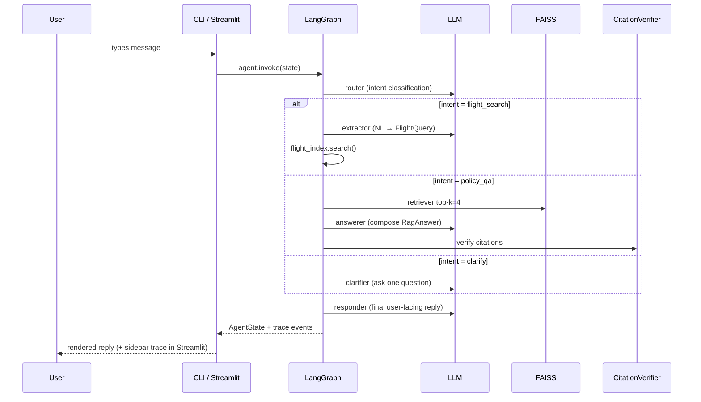
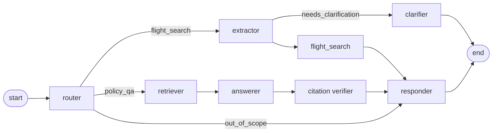

# Architecture

> Filled out in Block 9 with full per-node contracts. This file is the living architecture reference.

## Overview

The assistant is a **single Python process**. There is no client/server split: `main.py` (CLI) and `streamlit_app.py` (web UI) both import and run the same in-process LangGraph agent.

```
┌─────────────────────┐        ┌─────────────────────┐
│   main.py (CLI)     │───┐    │ streamlit_app.py    │───┐
│   Rich-formatted    │   │    │ Web UI + sidebar    │   │
│   REPL              │   │    │ trace inspector     │   │
└─────────────────────┘   │    └─────────────────────┘   │
                          ▼                              ▼
            ┌─────────────────────────────────────────────────┐
            │                  app/  package                   │
            │                                                  │
            │   ┌──────────────────────────────────────────┐  │
            │   │           LangGraph agent                 │  │
            │   │  router → extractor → flight_search      │  │
            │   │         ↓                                 │  │
            │   │      retriever → answerer → responder    │  │
            │   └──────────────────────────────────────────┘  │
            │                                                  │
            │   prompts/  (versioned .md + CHANGELOG)         │
            │   tools/    (flight_index + FAISS retriever)    │
            │   llm/      (client + tracing + verifier)       │
            │   memory/   (filter memory + override semantics)│
            │   schemas/  (Pydantic v2 contracts)             │
            └─────────────────────────────────────────────────┘
                                │
                                ▼
                  ┌──────────────────────────┐
                  │  data/                   │
                  │  ├── flights.json        │
                  │  ├── airports.json       │
                  │  └── kb/  (markdown KB)  │
                  └──────────────────────────┘
```

## Per-turn flow



## Graph topology



## State

```python
class AgentState(TypedDict, total=False):
    messages: list[Message]            # full conversation
    summary: str                        # rolling summary of older turns
    intent: Intent                      # router output
    flight_query: FlightQuery | None    # extracted + memory-merged
    flight_results: list[FlightResult]
    retrieved_chunks: list[Chunk]
    rag_answer: RagAnswer | None
    final_answer: str
    trace_events: list[TraceEvent]      # populated for sidebar
```

## Why this architecture

- **Single process** - one `pip install` and one command runs everything. No client/server coordination, no CORS, no SSE wiring.
- **LangGraph state machine** - intents have clear branches; LangGraph makes the graph explicit and inspectable. We chose this over LangChain's agent executor because the latter hides the routing logic in tool-calling loops, which is harder to reason about and debug.
- **Citation verifier as a graph node** - RAG hallucination is structurally impossible: any unverified claim is stripped before reaching the responder.
- **In-process trace capture** - every node emits `TraceEvent`s into state; the Streamlit sidebar renders them live without any extra plumbing.
